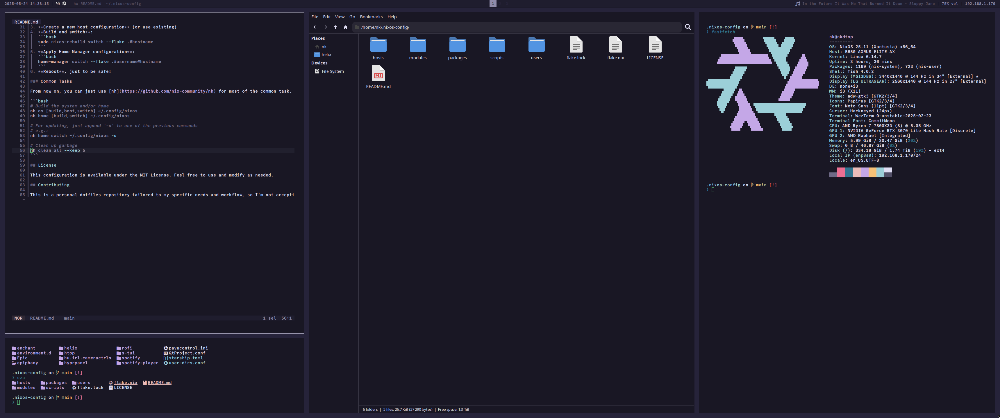

# Dotfiles

My personal NixOS configuration using flakes and Home Manager, supporting multiple hosts including desktops, laptops, servers, and VMs.

All desktop configurations are currently bundled with xorg+i3, but that is subject to change as I'm wm hopping quite frequently.
Servers, on the other hand, are in a very early work in progress state as I'm slowly migrating from Docker based WMs to something lighter using only Nix.



## Quickstart

### Prerequesites

- Fresh NixOS installation
- Access to  Git
- Flakes enabled

### Installation

1. **Enable flakes** (if not already enabled):
   ```bash
   # Add to /etc/nixos/configuration.nix
   nix.settings.experimental-features = [ "nix-command" "flakes" ];
   # Then run
   sudo nixos-rebuild switch
   nix shell nixpkgs#git
   ```
2. **Clone this repository**:
   ```bash
   git clone git@github.com:yanek/nixos-config.git ~/.config/nixos
   cd ~/.config/nixos
   ```
3. **Create a new host configuration** (or use existing)
4. **Build and switch**:
   ```bash
   sudo nixos-rebuild switch --flake .#hostname
   ```
5. **Apply Home Manager configuration**:
   ```bash
   home-manager switch --flake .#username@hostname
   ```
6. **Reboot**, just to be safe!

### Common Tasks

From now on, you can just use [nh](https://github.com/nix-community/nh) for most of the common task.

```bash
# Build the system and/or home
nh os [build,boot,switch] ~/.config/nixos
nh home [build,switch] ~/.config/nixos

# For updating, just append '-u' to one of the previous commands
# e.g.:
nh home switch ~/.config/nixos -u

# Clean up garbage
nh clean all --keep 5
```

## License

This configuration is available under the MIT License. Feel free to use and modify as needed.

## Contributing

This is a personal dotfiles repository tailored to my specific needs and workflow, so I'm not accepting contributions or pull requests. However, you're absolutely welcome to fork or clone this repository and adapt it for your own use! The configuration tries to be modular and customizable, making it easy to modify for different setups and preferences.
